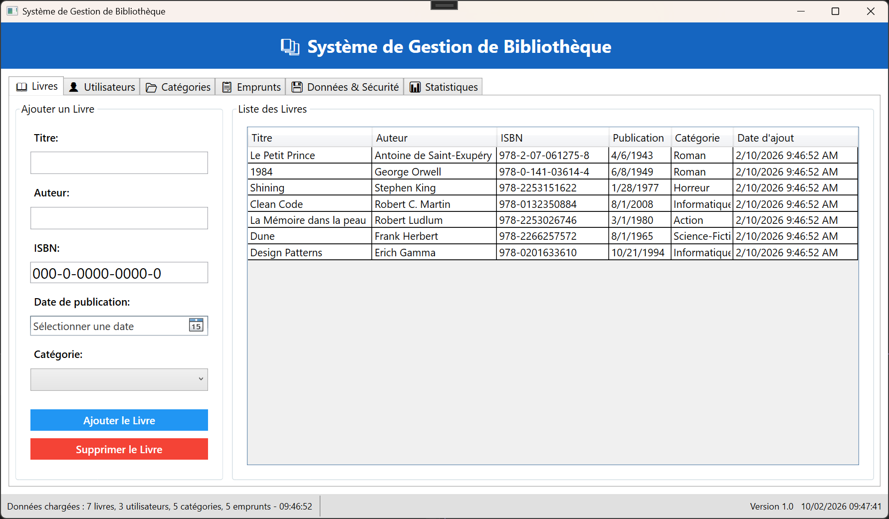
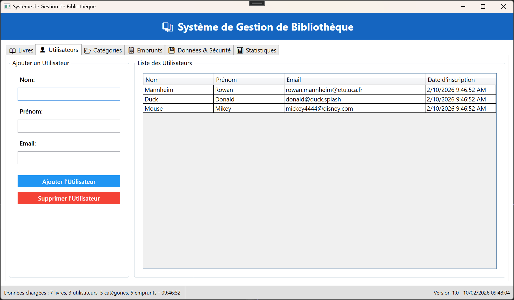
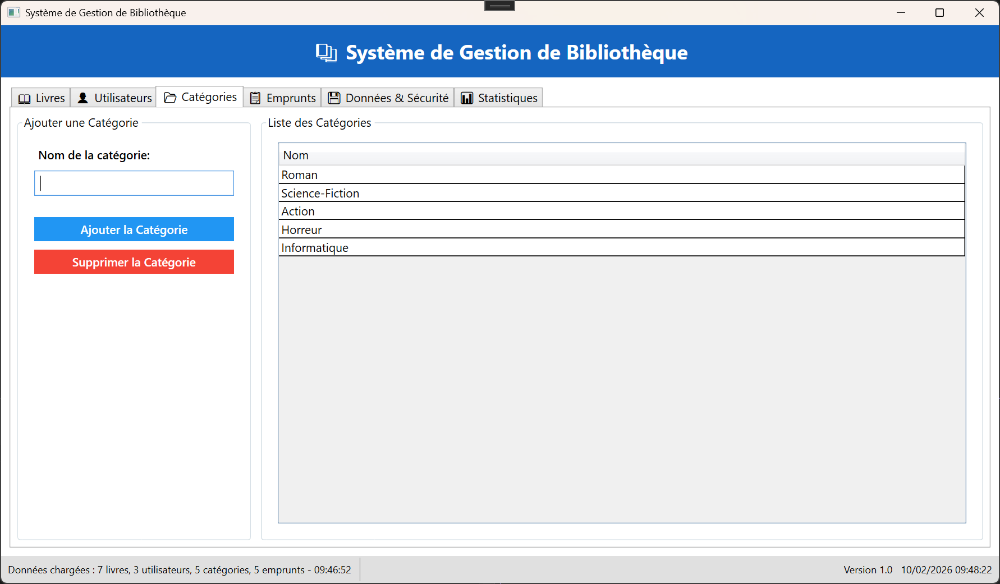
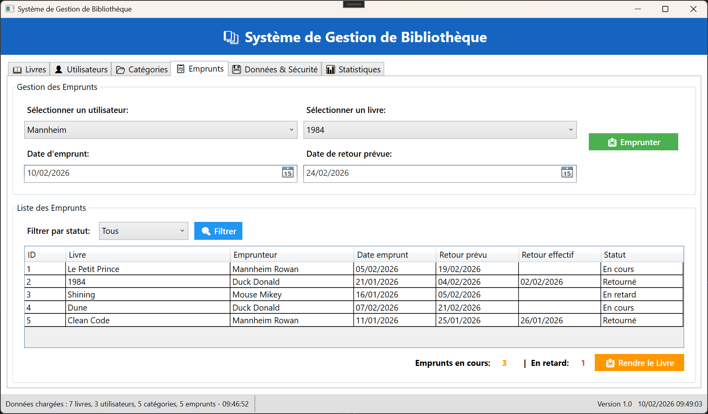
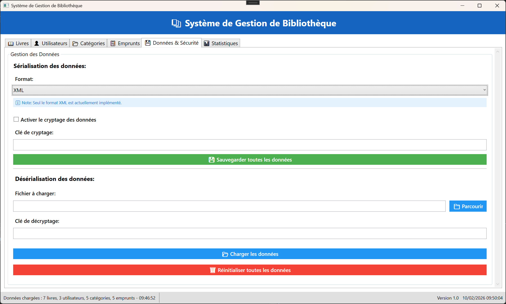

#### Projet de C# .NET - "Outil de gestion d'une Bibliothèque" - MANNHEIM Rowan - F2

Ce projet est une application graphique (WPF) développée en C# .NET. L'application permet de gérer une bibliothèque virtuelle, composée de livres, catégories, utilisateurs et emprunts. Les données sont sérialisables et dé sérialisables vers et depuis le format XML avec la possibilité de cryptage.

Solution .slnx développée avec VS 2026 Version : 18.1.1

| Livres | Utlisateurs | Catégories |
|:---:|:---:|:---:|
|  |  |  |

| Emprunts | Sérialisation |
|:---:|:---:|
|  |  

###### Fonctionnement : 

* A l'execution du programme, des données d'exemple sont toujours chargées dans la bibliothèque. Ce comportement peut être enlevé en remplaçant                 \_bibliothequeData = GenererDonneesExemple.Executer(); par \_bibliothequeData = new BibliothequeData(); dans InitializeBibliotheque().
* Ajout / Supression de Livres, Categories et Utilisateurs
* Enregistrer un Emprunt / Retour de Livre
* Sérialisation des données dans le fichier ***C:\\Users\\\[User]\\Documents\\Bibliotheque\\Bibliotheque\_\[user].xml***
* Choix du fichier .xml pour le chargement, avec clé de cryptage si nécessaire (SID Windows utilisé par défaut)
* ###### **/!\\ Mot de passe pour charger un fichier : *Bibliotheque***

###### Structure de la solution (5 projets) :

* Bibliothèque : Application WPF principale.
* Cryptage : Gère le cryptage et décryptage des fichiers, vérifie si un fichier est crypté.
* Data : Classes (les classes de données), BibliothequeData (regroupe toutes les données pour la sérialization), BibliothequeFileService (gère la sauvegarede et chargement des données).
* Password : gère la protection par mot de passe.
* Serialization : Gère la sérialization et dé-sérialization (Appelé par FileService).

###### Difficultés rencontrées, solutions et choix techniques:

* Peu d'expérience avec design pattern "Factory". Implémentation difficile de la SerializationFactory, et très overkill au final puisque la seule strategie de sérialization qui à été implémentée est le XML. (Binaire prévu initialement).
* L'utlisation de CryptoStream était plus compliquée que prévue, utilisation de l'IA pour obtenir une methode de cryptage "sûre" (Aes + Salt).
* Je n'ai pas vraiment saisi le but de la protection par mot de passe. Le cryptage réversible avec une clé me semble suffisant pour garantir la sécurité. J'ai tout de même implémenté un **"mot de passe général" (par défaut *Bibliotheque*)** requis pour charger un fichier. Cepandant, cette fonctionnalité a peu d'utilité et pas très sécurisée puisque c'est un code et hard codé propre au programme quelque soit la bibliothèque chargée.

* La classe BibliothequeData.cs permet de regrouper toutes les données d'une bibliothèque au même endroit, fortement utile pour la sérialization, mais à nécessité pas mal de travail puisque les données doivent bien être mis à jour pour quasiment toute action provenant de l'interface graphique.
* Des champs \[XmlElement("")] pour pouvoir sérializer les données stockes en classes intialement (ex: la catégorie d'un livre, sauvegardée sous forme d'un sting "CategorieNom" puis reconstruite en Categorie lors du chargement grâce aux méthodes ReconstruireReferences()).
* Ajout d'une classe Emprunt pour pouvoir gérer les emprunts de manière efficace (état en cours, en retard).
* Utilisateur et Livres : DateAjout et DateInscription gérées automatiquement par le système avec DateTime.Now

* Tous les champs sont obligatoires pout l'ajout d'un Livre, Utilisateur et Catégorie.
* Doublons non autorisés 
* Plusieurs emprunts par un Utilisateur possible (historique), mais un livre ne peut être emprunté que par une personne à la fois.
* Impossibilité de supprimer une catégorie si livres l'utlisent, ou un livre si emprunt en cours.
* Historique des retards grâce à la date de retour.
